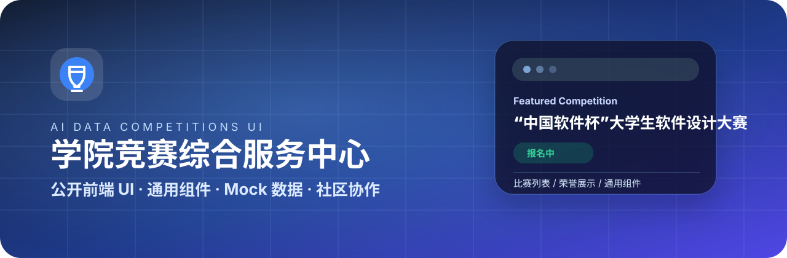

<div align="center">



# ai-data-competitions-ui

广东金融学院大数据与人工智能学院竞赛综合服务中心公开 UI 仓库。

[](https://nextjs.org/)
[](https://react.dev/)
[](https://www.typescriptlang.org/)
[](https://tailwindcss.com/)
[](#参与贡献)
[](#license)

面向学生竞赛场景的门户首页、比赛列表、荣誉展示和通用 UI 组件。公开仓库只保留前端展示、通用组件、演示数据和协作文档，不包含生产后端、真实数据、权限系统或部署密钥。

</div>

## 效果预览

| 首页门户 | 比赛列表 |
| --- | --- |
|  |  |

## 项目定位

`ai-data-competitions-ui` 是学院竞赛综合服务中心的公开前端 UI 子仓库，目标不是开放完整业务系统，而是把可公开协作的界面层独立出来，方便学生开发者参与 UI、交互、组件和文档建设。

本仓库适合承载以下内容：

- 学生门户首页、比赛列表、荣誉展示等公开页面。
- 比赛卡片、状态徽标、导航栏、搜索筛选、表格、弹窗等通用组件。
- Mock 数据、演示状态和静态资源。
- UI 设计说明、组件约定、Issue / PR 协作规范。

本仓库不承载以下内容：

- 生产环境后端服务、数据库结构和真实业务数据。
- 用户认证、权限控制、管理端私有逻辑和内部接口实现。
- 部署密钥、Token、服务器配置和任何非公开服务地址。

## 主要功能

### 首页门户

首页用于展示平台定位、重点赛事入口、通知公告、荣誉成果和行动引导。当前视觉以深色渐变、点阵背景、胶囊导航和重点赛事卡片为主，适合学院级竞赛服务入口。

### 比赛列表

比赛列表用于按年份、报名状态、比赛分类和归属学院快速浏览比赛入口。卡片展示比赛名称、类别、摘要、报名窗口、报名方式、名单类型和详情入口。

### 荣誉展示

荣誉展示用于沉淀奖状作品墙、竞赛达人风采和成果记录，让门户不仅承担报名入口，也能展示学院竞赛建设成果。

### 通用组件

仓库沉淀按钮、卡片、徽标、输入框、选择器、表格、弹窗、抽屉、导航、侧边栏、图表容器等组件，后续页面应优先复用现有组件再做扩展。

### Mock 数据

公开仓库使用 Mock 数据支撑独立预览。贡献者可以在不接入真实后端的情况下完成页面结构、交互状态、响应式布局和文案优化。

## 技术栈

| 方向 | 技术 |
| --- | --- |
| 应用框架 | Next.js 16 / React 19 |
| 开发语言 | TypeScript |
| 样式系统 | Tailwind CSS 4 |
| 组件基础 | Radix UI / shadcn/ui 风格组件 |
| 动效 | Framer Motion |
| 图表 | Recharts |
| 数据 | Mock 数据驱动的前端预览 |

具体依赖版本以 `package.json` 为准。

## 快速开始

```bash
git clone git@github.com:GDUF-quantitative/ai-data-competitions-ui.git
cd ai-data-competitions-ui
pnpm install
pnpm dev
```

常用脚本：

```bash
pnpm dev      # 启动本地开发环境
pnpm build    # 构建生产包
pnpm start    # 启动构建后的应用
pnpm lint     # 运行 ESLint 检查
```

默认开发地址通常为：

```bash
http://localhost:3000
```

## 目录说明

```bash
.
├── app/                    # Next.js 页面路由与页面入口
├── components/             # 通用组件与业务展示组件
├── data/                   # Mock 数据与演示内容
├── docs/                   # 功能文档、协作说明与设计资料
├── lib/                    # 工具函数与公共逻辑
├── public/                 # 静态资源
├── styles/                 # 全局样式
├── .github/                # Issue / PR 模板
├── package.json            # 项目脚本与依赖
└── README.md               # 项目入口文档
```

实际目录结构可能随项目演进调整，请以当前仓库为准。

## 文档索引

| 文档 | 说明 |
| --- | --- |
| [`docs/功能介绍.md`](docs/功能介绍.md) | 页面功能、组件范围、Mock 数据和视觉动效说明。 |
| [`docs/开源协作指南.md`](docs/开源协作指南.md) | Issue、PR、提交规范、截图要求和仓库边界。 |
| [Pull Request 模板](.github/PULL_REQUEST_TEMPLATE.md) | 提交 PR 时建议填写的修改内容、影响范围和验证方式。 |

## 参与贡献

欢迎提交 UI 优化、移动端适配、组件抽象、文案修正、可访问性改进和文档补充类 PR。提交前请确认修改范围清晰，不混入真实数据、密钥、内部接口或生产环境配置。

推荐流程：

```bash
git checkout -b docs/update-readme-showcase
pnpm install
pnpm dev
pnpm build
pnpm lint
git add .
git commit -m "docs: 优化开源展示文档"
git push -u origin docs/update-readme-showcase
```

推荐分支命名：

```bash
feat/home-hero-section
fix/mobile-navbar-layout
docs/update-feature-introduction
refactor/competition-card
```

推荐 Commit 格式：

```bash
feat: 优化首页 Hero 展示区域
fix: 修复移动端导航折叠异常
docs: 补充功能介绍文档
refactor: 抽离赛事卡片组件
```

## PR 检查清单

- [ ] 修改范围清晰，没有混入无关改动。
- [ ] 页面可以正常启动和预览。
- [ ] `pnpm build` 通过，或在 PR 中说明未执行原因。
- [ ] `pnpm lint` 通过，或在 PR 中说明未执行原因。
- [ ] 没有提交真实数据、密钥、Token 或内部服务地址。
- [ ] 涉及 UI 变化时附上截图或录屏。
- [ ] 涉及 Mock 数据时说明字段含义和用途。

## FAQ

### 这个仓库是完整系统吗？

不是。本仓库是公开 UI 仓库，只包含前端展示、通用组件、演示数据和协作文档。完整生产系统还包括后端服务、数据库、权限控制和部署配置，这些内容不放在本仓库中。

### 可以提交真实接口吗？

不建议直接接入真实生产接口。如果某个 UI 功能需要接口支持，请先用 Mock 数据完成页面结构，并在 Issue 或 PR 中说明需要的接口字段。

### 可以提交真实比赛数据吗？

不建议。公开仓库应避免提交真实业务数据。演示内容请使用 Mock 数据、虚构数据或脱敏数据。

### 这个仓库会直接部署到生产环境吗？

不会作为完整生产系统直接部署。生产环境部署逻辑由私有仓库负责，本仓库主要承担公开 UI 展示和社区协作功能。

## License

本项目采用 MIT License。
