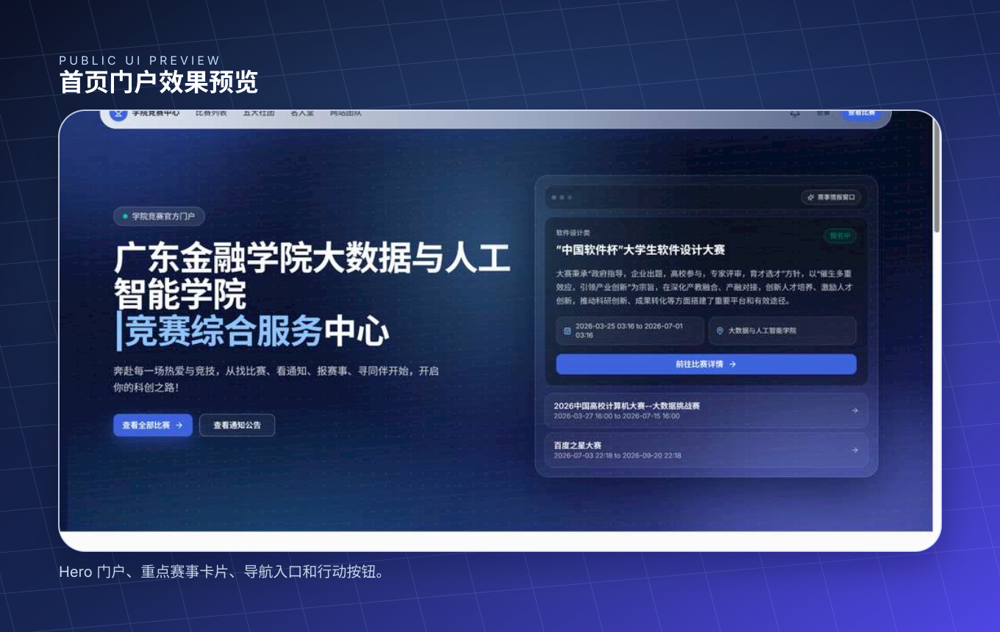
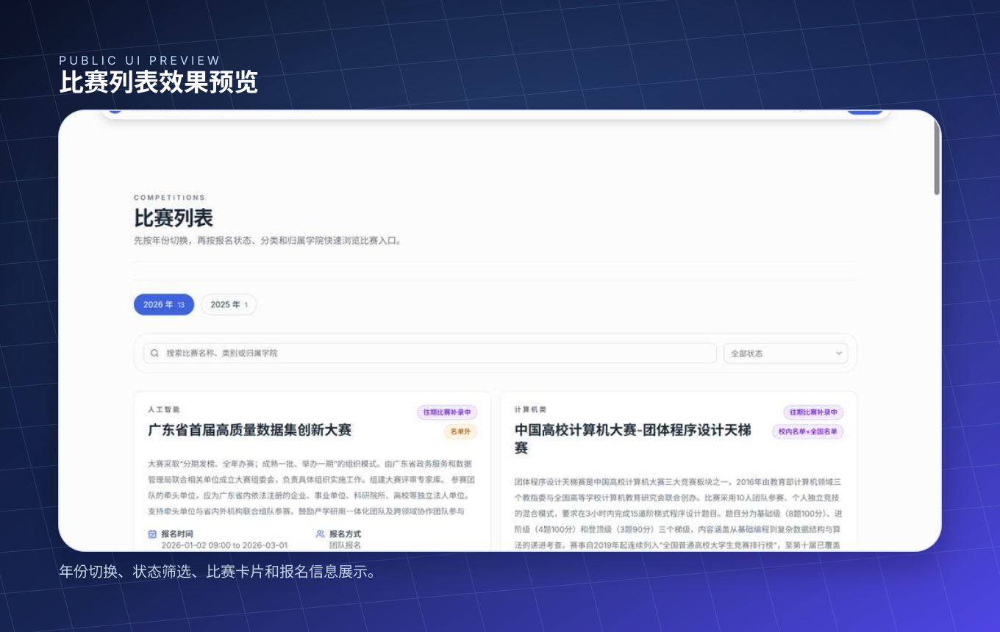

# 功能介绍

本仓承载完整 Web，数据与命令经 API。下表描述当前源码入口和限制；不代表浏览器或生产流程已验收。

## 门户预览

以下为效果示意，非当前版本浏览器验收截图。

| 首页门户 | 比赛列表 |
| --- | --- |
|  |  |

[品牌示意](./assets/brand-banner.svg)与上述素材只用于展示说明。

## 当前功能

| 范围 | 页面/交互 | 当前限制 |
| --- | --- | --- |
| 公开门户 | 首页、比赛列表/详情、通知、社团、奖状、名人堂、人物/经验、网站团队 | 当前 API 返回公开 DTO；无 Mock fallback，团队资料由代码维护 |
| 认证 | 学生/教师注册、登录、找回/重置密码 | public 模式不接真实身份；身份与会话签名由 API 处理 |
| 报名 | 动态表单、团队成员、提交、本人记录、编辑/撤回与审核时间线 | 时间、状态、编号、归属和事务由 API 校验 |
| 问答 | 比赛问答、分页、回答、树形评论、采纳和治理 | 操作能力由 API 当前身份返回；Markdown 不启用原始 HTML |
| 个人工作台 | 资料、成果、经验、名人堂与社团内容 | 经验/名人堂需管理员邀请，页面存在不开放自助创建 |
| 业务管理 | 比赛、报名审核/导出、用户、通知、奖状/经验审核、名人堂和社团 | 菜单按 API 能力展示，具体接口再做服务端对象授权 |
| 分析与 SQL | 指标、趋势、漏斗、风险与结构化查询/结果导出 | SQL 为白名单契约，不提供任意原始 SQL；指标不表示因果结论 |
| 安全中心 | 事件、告警、动作与态势地图 | 实际执行器在 API，目前只有 IP 放行/回滚；展示不等于动作生效 |

完整路由见[页面结构](./页面结构与用户流程.md)，共享组件与自动回归见[代码组织](./代码组织与组件约定.md)。

## 目标与实现差距

社团当前仍使用个人工作台和平台审核。取消审核、统一后台权限/入口、封面必传是 [API #70](https://github.com/gduf-community/competition-Q-A-website/issues/70)的改版目标；本次文档整理不改变业务行为。浏览器兼容、移动端输入和视觉改版仍按各自任务验收。

默认 public 预览只读，不接受私有写入或身份 Cookie；trusted 业务模式也不向 Web 注入后端凭据。[环境说明](./开发环境与HTTP边界.md)列出运行与真实部署边界。

返回[文档入口](./README.md)。
